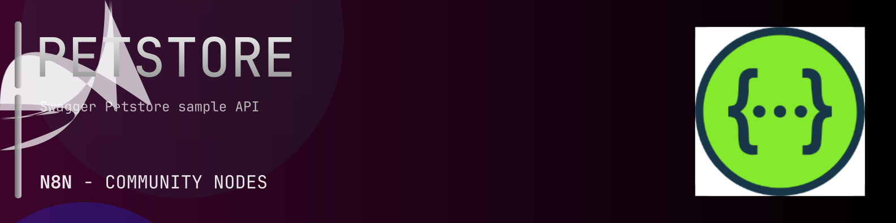

# @n8n-dev/n8n-nodes-petstore



[](https://www.npmjs.com/package/@n8n-dev/n8n-nodes-petstore)
[](https://opensource.org/licenses/MIT)

---

**Stop writing petstore API integrations by hand.**

Every time you connect n8n to petstore, you waste hours mapping endpoints, defining parameters, and debugging schemas. You copy-paste from docs, fix edge cases, and pray nothing breaks.

**What if connecting n8n to petstore took 5 minutes, not half a day?**

This node gives you **3+ resources** out of the box: **Pet**, **Store**, **User**: with full CRUD operations, typed parameters, and zero manual configuration.

---

## What You Get

- **Zero boilerplate**: Resources, operations, and fields are pre-configured and ready to use
- **Full CRUD**: Create, read, update, and delete support where the API allows it
- **Typed parameters**: No more guessing field types
- **Built-in auth**: API key authentication, ready to go
- **Declarative**: Native n8n performance, no custom execute() overhead

---

## Install

```bash
npm install @n8n-dev/n8n-nodes-petstore
```

**Or in n8n:**
1. **Settings → Community Nodes → Install**
2. Search: `@n8n-dev/n8n-nodes-petstore`
3. Click **Install**

---

## Quick Start

1. Install the node (above)
2. Add credentials: **petstore API** → paste your API key
3. Drag the **petstore** node into your workflow
4. Pick a resource → pick an operation → done.

That's it. No configuration files. No code. It just works.

---

## Resources

<details>
<summary><b>Pet</b> (8 operations)</summary>

- Put Update an existing pet
- Post Add a new pet to the store
- Get Finds Pets by status
- Get Finds Pets by tags
- Get Find pet by ID
- Post Updates a pet in the store with form data
- Delete s a pet
- Post Uploads an image

</details>

<details>
<summary><b>Store</b> (4 operations)</summary>

- Get Returns pet inventories by status
- Post Place an order for a pet
- Get Find purchase order by ID
- Delete purchase order by identifier

</details>

<details>
<summary><b>User</b> (7 operations)</summary>

- Post Create user
- Post Creates list of users with given input array
- Get Logs user into the system
- Get Logs out current logged in user session
- Get user by user name
- Put Update user resource
- Delete user resource

</details>

---

## Why This Node?

**Without this node:**
- Hours of manual API integration
- Copy-pasting from petstore docs
- Debugging auth, pagination, error handling
- Maintaining your own client code

**With this node:**
- Install → configure → use. 5 minutes.
- Auto-generated from the official petstore OpenAPI spec
- Always up to date when the API changes
- Native n8n performance

---

## Auto-Generated
This node was auto-generated from the official **petstore** OpenAPI specification using
[@n8n-dev/n8n-openapi-node-ultimate](https://github.com/kelvinzer0/n8n-openapi-node-ultimate),
then validated against the live API so you get accurate types and real parameters, not guesswork.

When the petstore API updates, this node updates too.

---


## License

MIT © [kelvinzer0](https://github.com/n8n-code)
